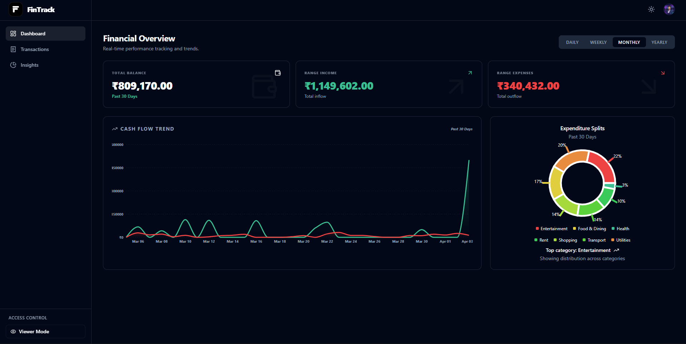
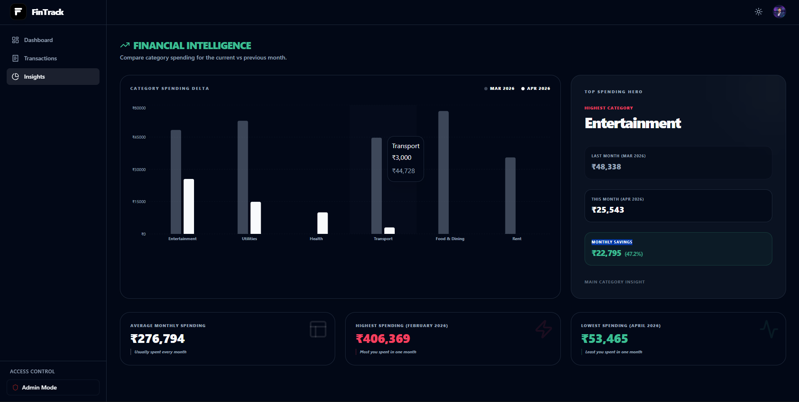
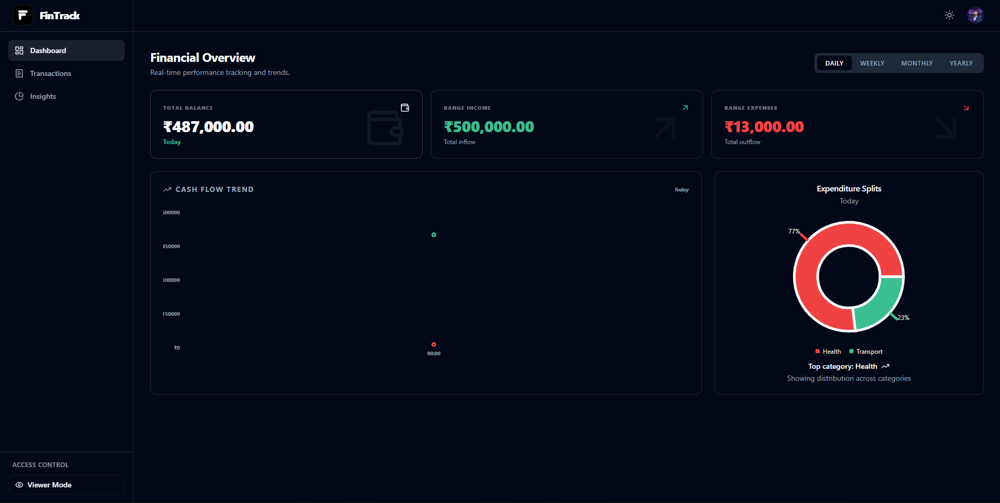

# FinTrack – Smart Finance Dashboard

A clean and modern finance dashboard built using React, TypeScript, and Tailwind CSS to help you track spending, savings, and financial trends—without confusion.

## 📸 Screenshots

<div align="center" style="display: grid; grid-template-columns: repeat(2, 1fr); gap: 16px; max-width: 800px; margin: auto;">
  
  
  
  
</div>

## 🚀 Key Features

### 📊 Financial Intelligence (Insights)
- **Top Category Hero**: A focal card on the Insights page that identifies your highest spending category and compares it to last month's data.
- **Monthly Delta Analysis**: Real-time spending comparison showing exactly how much you **Saved** or **Spent More** relative to the previous month.
- **Historical Scaling**: Dynamic identification of Average, Maximum, and Minimum monthly spending patterns across your entire history.

### 🗂️ Transaction Power Suite
- **Advanced Control**: Full CRUD (Create, Read, Update, Delete) capability with instant pagination (15 items/page).
- **Flexible Management**: Grouping by **Category** or **Type**, and advanced filtering across Search and Date Ranges.
- **Export Power**: One-click **CSV** and **JSON** export for external auditing and data portability.
- **Smart Categorization**: Preset categories including **Transport, Food & Dining, Rent, Utilities,** and more.

### 🛡️ Basic Role-Based Access (RBAC)
- **Admin Mode**: Full access to add, edit, or delete any transaction.
- **Viewer Mode**: Read-only access to charts and history—perfect for safety-first demonstrations.
- **Persistent Toggle**: Switch roles instantly via the sidebar; your selection is remembered across sessions.

## 🛠️ Technical Implementation

- **100% Type Safe**: Built with strict TypeScript coverage, including a fully verified production build status.
- **State Architecture**: Uses **React Context API** with `useReducer` for robust, centralized state management.
- **Data Persistence**: All transactions, your selected role, and theme preference (Dark/Light) are persisted in **Local Storage**.
- **Performance**: Optimized chart rendering using `recharts` and efficient `useMemo` hooks for real-time analytics.

## 🏁 Quick Start

1. **Install Dependencies**
   ```bash
   npm install
   ```

2. **Generate Mock Data** (Optional)
   ```bash
   node scripts/generateMockData.mjs
   ```

3. **Run Development Server**
   ```bash
   npm run dev
   ```

---

Made in india
